## 1. 产品概述

用户反馈管理系统是面向在线教育机构的全流程反馈处理平台，覆盖学员提交、客服处理、教研跟进、数据分析全链路。旨在提升学员满意度，驱动课程质量和服务水平持续优化。

- 核心价值：将分散的学员声音转化为可追踪、可落地、可分析的改进闭环
- 目标用户：学员（提交反馈）、客服（工单处理）、教研人员（课件关联）、运营管理者（趋势分析）

## 2. 核心功能

### 2.1 用户角色

| 角色 | 核心权限 |
|------|----------|
| 学员 | 选择课程章节、提交反馈类型/满意度/文字、上传截图或录音、查看历史反馈 |
| 客服 | 查看反馈来源/紧急程度/历史报名、分类标记、指派处理、回复学员、关闭工单 |
| 教研人员 | 关联反馈到课件/题目/直播回放、标记是否需要修改、补充专业备注 |
| 管理员 | 全部权限、趋势分析、导出报表 |

### 2.2 功能模块

1. **反馈入口页（学员端）**：课程章节选择器、反馈类型分类、满意度星级评分、文字描述、截图/录音上传
2. **反馈列表页（客服端）**：多维度筛选、紧急程度标签、批量指派、快速预览
3. **工单处理详情页**：学员信息侧栏、内部备注、承诺完成时间、回访记录、处理状态流转
4. **学员画像页**：基础信息、历史报名课程、历史反馈记录、满意度趋势
5. **趋势分析页**：按课程/老师/班级/问题类型的统计卡片、高频词云、处理时长分布

### 2.3 页面详情

| 页面名称 | 模块名称 | 功能描述 |
|----------|----------|----------|
| 反馈入口页 | 课程章节选择 | 级联选择器：课程 → 章节 → 课时 |
| 反馈入口页 | 反馈类型选择 | 课程内容、作业批改、老师服务、平台体验、其他 |
| 反馈入口页 | 满意度评分 | 1-5星交互式评分组件，支持半星 |
| 反馈入口页 | 附件上传 | 拖拽上传截图（支持多图）、录音组件（录制+时长） |
| 反馈列表页 | 筛选工具栏 | 状态、紧急程度、来源、类型、时间范围筛选 |
| 反馈列表页 | 工单表格 | 工单编号、学员、类型、满意度、紧急度、状态、处理人、创建时间 |
| 反馈列表页 | 批量操作 | 批量指派、批量标记紧急、批量导出 |
| 工单处理页 | 学员信息侧栏 | 头像、姓名、手机号、报名课程数、历史满意度 |
| 工单处理页 | 处理操作区 | 分类标签、下拉指派、回复输入框、状态流转按钮 |
| 工单处理页 | 教研关联区 | 课件/题目/回放搜索、关联列表、修改需求标记 |
| 工单处理页 | 时间与回访 | 承诺时间日期选择器、回访记录时间线（新增/编辑/删除） |
| 工单处理页 | 内部备注 | 富文本备注区、@提及功能、仅内部可见 |
| 学员画像页 | 学员基本信息卡 | 头像、姓名、ID、注册时间、VIP等级 |
| 学员画像页 | 报名课程列表 | 课程名、班级、老师、报名时间、学习进度 |
| 学员画像页 | 反馈历史时间线 | 按时间倒序展示所有反馈及处理状态 |
| 学员画像页 | 满意度趋势图 | 近6月满意度折线图、均值参考线 |
| 趋势分析页 | 数据概览卡片 | 总反馈量、处理中数、已关闭数、平均处理时长、平均满意度 |
| 趋势分析页 | 多维度筛选 | 课程、老师、班级、问题类型下拉筛选器 |
| 趋势分析页 | 分布图表 | 反馈类型饼图、满意度柱状图、处理时长分布图 |
| 趋势分析页 | 高频词云 | 各维度下的关键词词云展示 |
| 趋势分析页 | 趋势折线图 | 按周/月的反馈量和满意度双轴趋势 |

## 3. 核心流程

学员从课程页面进入反馈入口 → 选择具体课程章节 → 选择反馈类型和满意度 → 输入文字描述并上传截图/录音 → 提交生成工单 → 客服在列表页筛选查看 → 客服标记分类并指派处理人 → 客服回复学员或教研人员关联课件 → 设置承诺完成时间并添加内部备注 → 处理完成后关闭工单 → 管理员在分析页查看多维度数据和高频词。

```mermaid
flowchart LR
    A["学员进入反馈入口"] --> B["选择课程章节"]
    B --> C["选择反馈类型+满意度"]
    C --> D["输入描述+上传附件"]
    D --> E["提交生成工单"]
    E --> F["客服筛选查看列表"]
    F --> G["标记分类+指派处理人"]
    G --> H["回复学员/教研关联课件"]
    H --> I["设置承诺时间+内部备注"]
    I --> J["关闭工单"]
    J --> K["管理员趋势分析"]
```

## 4. 用户界面设计

### 4.1 设计风格

- **主色调**：深沉墨绿 `#1F6B5A`（教育·专业·信任），辅助色：暖橙 `#FF8A3D`（行动·紧急）、天蓝 `#3DA5FF`（信息·关联）
- **中性色**：米白背景 `#FAF8F5`，深墨文字 `#1A2B2E`，次级文字 `#5A6B6E`
- **按钮风格**：圆角 8px，主按钮实心墨绿带细微阴影，次按钮描边，悬停提升 2px
- **字体**：标题用「思源宋体 Heavy」体现教育质感，正文用「PingFang SC / 微软雅黑」保证可读性
- **布局风格**：卡片式分区 + 细腻分隔线，列表端表格 + 详情页双栏（主内容 + 侧栏信息）
- **图标风格**：线性描边 Lucide 图标，关键操作带实心底色徽章

### 4.2 页面设计概览

| 页面名称 | 模块名称 | UI 风格说明 |
|----------|----------|-------------|
| 反馈入口页 | 整体布局 | 渐变绿顶栏 + 白色大卡片表单，步骤指示器引导填写 |
| 反馈入口页 | 评分组件 | 大号交互式星星，悬停发光，选中填充暖橙 |
| 反馈入口页 | 上传区域 | 虚线描边拖拽区，内含相机/麦克风图标缩略 |
| 反馈列表页 | 表格行 | 斑马纹淡绿底色，紧急行左侧橙色色条标识 |
| 反馈列表页 | 筛选条 | 胶囊形筛选标签，多选中实色填充 |
| 工单处理页 | 时间线 | 左侧竖线 + 节点圆点，时间戳小字右对齐 |
| 工单处理页 | 状态流转 | 顶栏状态徽章，可点击下拉切换，带渐变过渡 |
| 学员画像页 | 信息卡 | 圆形头像 + 渐变装饰环，VIP 皇冠角标 |
| 趋势分析页 | 数据卡片 | 大数字 + 小趋势箭头，背景浅绿米白渐变 |
| 趋势分析页 | 词云 | 不规则大小排列，关键词墨绿/橙色渐变填充 |

### 4.3 响应式设计

桌面优先（1280px 基准），1024px 断点下列表表格缩减列，侧栏折叠为抽屉；768px 移动端适配单列堆叠，表单全宽。触控目标最小 44×44px。
