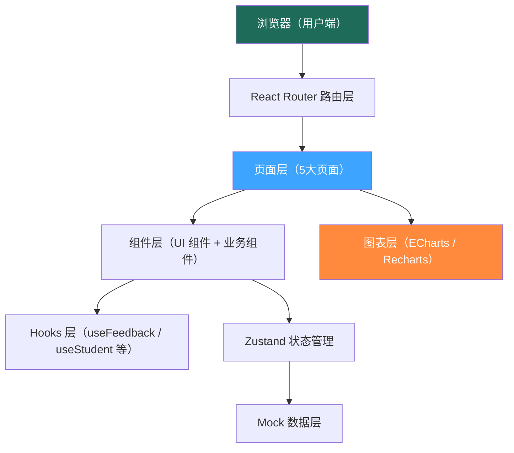

## 1. 架构设计



## 2. 技术栈说明

- **前端框架**：React 18 + TypeScript
- **初始化工具**：Vite（vite-init react-ts 模板）
- **路由**：React Router DOM 6.x
- **样式方案**：Tailwind CSS 3.x + CSS 变量主题
- **状态管理**：Zustand
- **图表库**：Recharts（轻量级 React 原生图表）
- **图标库**：Lucide React
- **数据方案**：纯前端 Mock 数据（`src/mock/`），不设后端
- **包管理器**：npm（默认）

## 3. 路由定义

| 路由路径 | 页面组件 | 用途说明 |
|----------|----------|----------|
| `/` | 重定向至 `/submit` | 默认入口 |
| `/submit` | FeedbackSubmit | 学员反馈入口页（表单提交） |
| `/tickets` | TicketList | 客服反馈列表页（工单列表+筛选） |
| `/tickets/:id` | TicketDetail | 工单处理详情页（全流程处理） |
| `/students/:id` | StudentProfile | 学员画像页 |
| `/analytics` | Analytics | 趋势分析页 |

## 4. 数据模型

### 4.1 实体关系

```mermaid
erDiagram
    STUDENT ||--o{ FEEDBACK : "提交"
    STUDENT ||--o{ ENROLLMENT : "报名"
    COURSE ||--o{ CHAPTER : "包含"
    CHAPTER ||--o{ LESSON : "包含"
    FEEDBACK }o--|| COURSE : "关联到"
    FEEDBACK }o--o| TEACHER : "关联到"
    FEEDBACK ||--o{ COMMENT : "产生"
    FEEDBACK ||--o{ VISIT_RECORD : "产生"
    FEEDBACK }o--o| COURSEWARE : "关联到"
    TEACHER ||--o{ ENROLLMENT : "授课"

    STUDENT {
        string id PK
        string name
        string phone
        string avatar
        date registerDate
        string vipLevel
    }
    FEEDBACK {
        string id PK
        string studentId FK
        string courseId FK
        string chapterId
        string lessonId
        string type
        int satisfaction
        string content
        string attachments
        string urgency
        string status
        string assignee
        date promisedAt
        date createdAt
        date closedAt
    }
    COMMENT {
        string id PK
        string feedbackId FK
        string author
        string content
        boolean internal
        date createdAt
    }
```



### 4.2 核心类型定义

```typescript
// 反馈类型
type FeedbackType = 'course_content' | 'homework' | 'teacher_service' | 'platform' | 'other';
// 紧急程度
type UrgencyLevel = 'low' | 'normal' | 'high' | 'urgent';
// 工单状态
type TicketStatus = 'pending' | 'processing' | 'teaching' | 'replied' | 'closed';
// 满意度
type Satisfaction = 1 | 2 | 3 | 4 | 5;

interface Student {
  id: string;
  name: string;
  phone: string;
  avatar: string;
  registerDate: string;
  vipLevel: 'normal' | 'silver' | 'gold' | 'diamond';
  enrollmentCount: number;
  avgSatisfaction: number;
}

interface Course {
  id: string;
  name: string;
  teacherId: string;
  chapters: Chapter[];
}

interface Chapter { id: string; name: string; lessons: Lesson[]; }
interface Lesson { id: string; name: string; }

interface Feedback {
  id: string;
  ticketNo: string;
  studentId: string;
  studentName: string;
  studentAvatar: string;
  courseId: string;
  courseName: string;
  chapterId?: string;
  chapterName?: string;
  lessonId?: string;
  lessonName?: string;
  type: FeedbackType;
  satisfaction: Satisfaction;
  content: string;
  screenshots: string[];
  recordings: { url: string; duration: number }[];
  source: 'app' | 'web' | 'wechat' | 'phone';
  urgency: UrgencyLevel;
  status: TicketStatus;
  assignee?: string;
  category?: string;
  promisedAt?: string;
  createdAt: string;
  closedAt?: string;
}
```

## 5. 目录结构

```
src/
├── components/           # 可复用组件
│   ├── layout/           # Layout 组件（导航、侧栏）
│   ├── ui/               # 基础 UI 组件（Button/Card/Modal...）
│   ├── feedback/         # 反馈相关业务组件
│   ├── student/          # 学员画像相关组件
│   └── analytics/        # 分析相关组件（词云等）
├── pages/                # 页面组件
│   ├── FeedbackSubmit.tsx
│   ├── TicketList.tsx
│   ├── TicketDetail.tsx
│   ├── StudentProfile.tsx
│   └── Analytics.tsx
├── hooks/                # 自定义 Hooks
│   ├── useFeedback.ts
│   └── useStudent.ts
├── store/                # Zustand 状态
│   └── feedbackStore.ts
├── mock/                 # Mock 数据
│   ├── students.ts
│   ├── courses.ts
│   ├── feedbacks.ts
│   └── analytics.ts
├── types/                # TypeScript 类型
│   └── index.ts
├── utils/                # 工具函数
│   ├── format.ts
│   └── wordcloud.ts
├── App.tsx               # 路由入口
├── main.tsx
└── index.css             # 全局样式 + Tailwind
```
